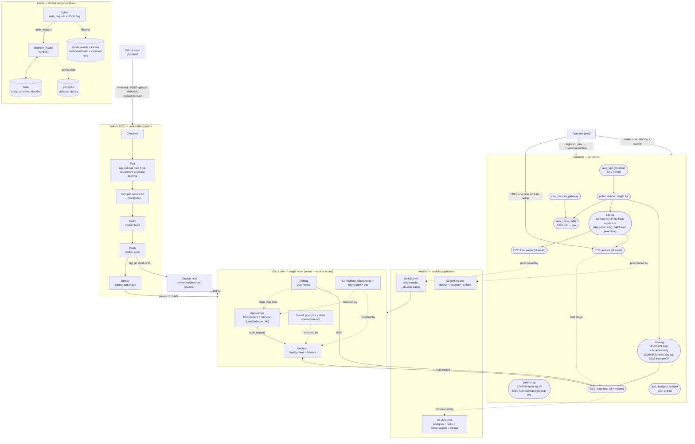

# Architecture

What this repo builds, in one diagram, and which tool is responsible for which
part. See `README.md` to actually run it.

## Who owns what

| Layer | Tool | Responsibility |
|---|---|---|
| Local development | **Docker Compose** | The entire app — nginx, bouncer, redis, postgres, and (in the observability override) elasticsearch + kibana + filebeat. Every dashboard is built and exported here, at zero cost, before anything touches AWS. |
| Cloud infrastructure | **Terraform** | VPC, one public subnet, IGW, route table, three security groups, three EC2 instances (all pinned to standard CPU credits), a Budget alarm. Local state (gitignored, solo/single-machine project) — `apply`/`destroy` are idempotent and reversible. |
| Node configuration | **Ansible** | One playbook installs k3s, single node, `--disable traefik`; one provisions the data host (Postgres, Redis, Elasticsearch, Kibana); one provisions Jenkins. Agentless (SSH), run from the operator's laptop against a manually-filled, gitignored inventory. |
| Cluster orchestration | **k3s** | Single-binary Kubernetes; ServiceLB gives a `type: LoadBalancer` Service a real public IP on port 80 with no cloud load balancer to pay for. |
| Application definition | **kubectl YAML manifests** | Deployment + Service + ConfigMap + Secret per component (`k8s/*.yaml`). Only the image tag changes per deploy (`kubectl set image`), same as the previous project. |
| App packaging | **Docker + Docker Hub** | Only `bouncer/Dockerfile` is custom-built — Jenkins tags each build with the triggering commit's short SHA and pushes it. nginx-edge runs the stock `nginx:alpine` image unmodified; its behavior comes entirely from the mounted `nginx.conf`/site ConfigMap, so it never needs a build or push step. |
| CI/CD | **Jenkins + GitHub webhook** | The only fully automated path from `git push` to a live rollout. Test runs first, against the real data host, so a bad code or `robots.txt` change is caught **before** anything is built or deployed — and the stage worth demoing: it compiles `robots.txt` into the ConfigMap on every merge. |
| Observability | **Filebeat → Elasticsearch → Kibana** | Decoupled from the request path — if Elasticsearch is down, enforcement still works. No Logstash, no Grafana, no Prometheus. Kibana has no public route; reach it with an SSH tunnel through the k3s node (`data-sg` only opens 5601 to the k3s security group and the operator's own IP). |
| Cost control | **`make nuke` / `make cost`** (`scripts/`) | `terraform destroy` plus a region-wide sweep for orphaned instances, volumes, EIPs, NAT gateways and load balancers. Verified to report zero survivors *before* the first `apply`, not after. |
| Secrets | **`.env` + `login.sh`** (AWS) / **Jenkins credentials store** (Docker Hub token, kubeconfig, webhook secret) | Nothing credential-bearing is ever committed. |

## Cost ceiling

`make nuke` (`terraform destroy` + a region-wide sweep) is built and verified
*before* the first expensive resource exists, not bolted on afterward —
that's what makes the $15/3-day budget actually holdable. Anything
environment-specific (`terraform.tfstate`, `ansible/inventory.ini`,
`kubeconfig`) is gitignored and regenerated per run.
