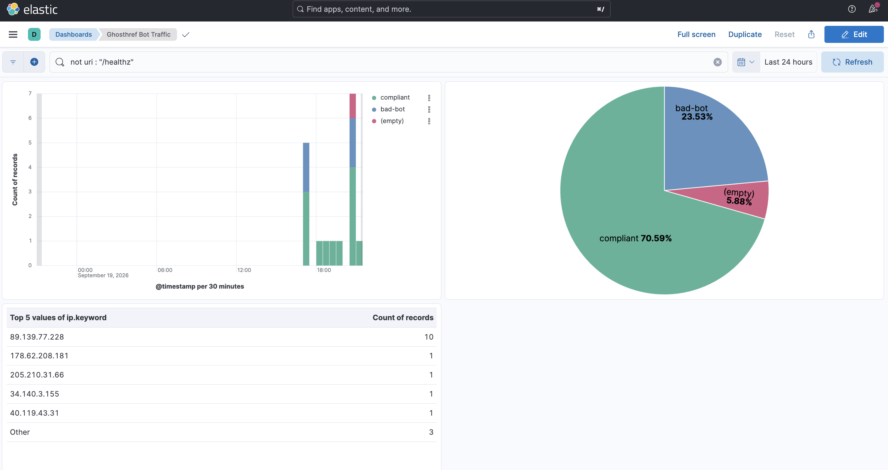

# ghosthref, in one minute

## The problem

Websites publish a `robots.txt` file asking automated crawlers to stay out of
certain pages. Well-behaved bots (search engines) respect it. Most others
don't — and until now, there was no way to prove it, or do anything about it.

## The idea: catch bots two ways

**1. They read the rules and broke them anyway.**
A fake page is listed as off-limits in `robots.txt`. Nothing on the real site
links to it. Any visit to that page means someone read the rule and ignored
it.

**2. They never read the rules at all.**
The same fake page is also linked from the homepage — but invisibly, in a way
no human could ever see or click. Only a bot blindly following every link on
the page would land there.

Either way, the visitor is a bot, not a person — and now there's proof.

## What happens next

- First few violations: just log it.
- Keep coming back: get slowed down.
- Keep ignoring that: get blocked.
- A real person asking a tool like ChatGPT about the page (which fetches it
  live, on demand) is never punished for that — only bulk automated crawling
  is.

## How it's built

A small Node.js service sits in front of the website and makes this decision
on every request, in milliseconds. It runs the same way on a laptop (Docker)
and on a real 3-server AWS cluster (Kubernetes) — infrastructure created with
Terraform, machines configured with Ansible, and every code change deployed
automatically by Jenkins. Every decision is logged and shown on a live
dashboard:

## Want more detail?

- How to run it, step by step: [`README.md`](README.md)
- How it's built, piece by piece: [`ARCHITECTURE.md`](ARCHITECTURE.md)
